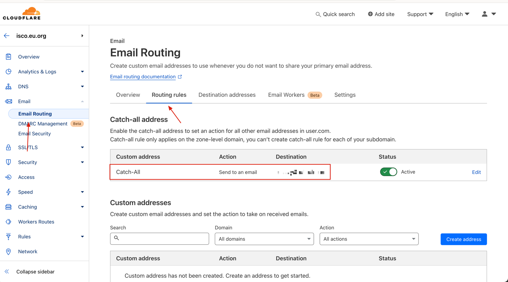
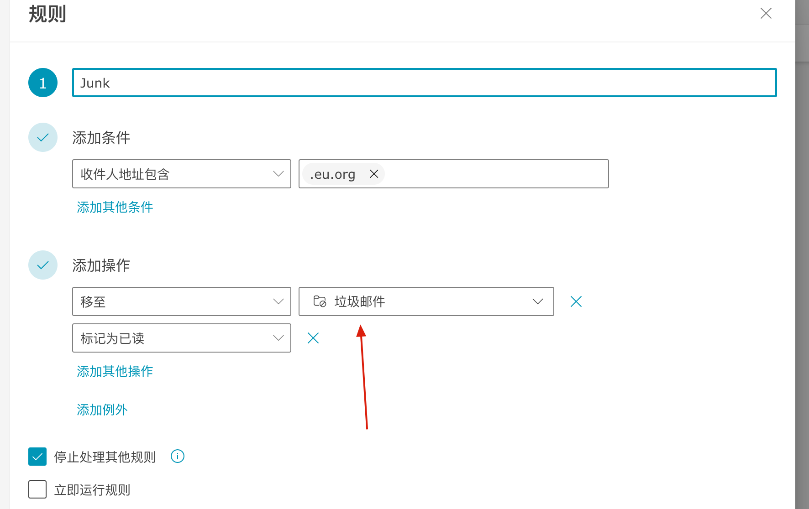

# 🧰 自建部署教程

## 邮件接收原理

使用 Cloudflare 的邮件转发功能，将接收到的所有邮件转发到目标邮箱中，然后本程序会从目标邮箱中获取邮件。

**所以自建邮箱域名必须使用 Cloudflare 进行 DNS 解析**

## 开启邮件转发

1. 首先开启邮件转发，按照官方流程来就行

2. 然后需要添加一条`Catch-All`的规则到目标邮箱中，如图:

此处需要一个自己的邮箱作为目标邮箱，推荐使用 Outlook _（环境变量配置也是基于此邮箱）_



## 配置邮件接收规则

默认会从垃圾邮件`Junk`文件夹中获取，可通过`IMAP_PATH`环境变量指定。

需要添加一个或多个邮件规则，将接收到的目标邮件移动到指定的文件夹下 _（需要将图中的`.eu.org`替换为自己的域名，可配置多个）_



## 环境变量配置

- `IMAP_USER`: 目标邮箱地址（必须）
- `IMAP_PASS`: 目标邮箱密码（必须）
- `DOMAIN_LIST`: 支持的域名列表，使用`|`分割，例如: `@isco.eu.org|@sliu.eu.org`，不要忘记`@`符号（必须）
- `IMAP_HOST`: 默认为`outlook.office365.com`（非必须）
- `IMAP_PORT`: 默认为`993`（非必须）
- `IMAP_PATH`: 默认为`Junk`（非必须）
- `HOSTNAME`: 服务监听地址，默认为`127.0.0.1`（非必须）
- `PORT`: 服务监听端口，默认为`3002`（非必须）
- `MICROSOFT_CLARITY`: 微软 Clarity 统计，默认关闭（非必须）

## 部署

_请修改其中的环境变量配置_

### Docker

```shell
docker run --name mail -d --restart unless-stopped -e 'HOSTNAME=0.0.0.0' -e 'IMAP_USER=xxx@xx.com' -e 'IMAP_PASS=xxx' -e 'DOMAIN_LIST=@isco.eu.org|@sliu.eu.org' -p 3002:3002 sunls24/temporary-mail
```

### Docker Compose & Caddy (推荐)

_如果不需要反向代理，需要设置`HOSTNAME=0.0.0.0`环境变量_

**docker-compose.yaml**

```yaml
version: "3.0"

services:
  mail:
    container_name: mail
    image: sunls24/temporary-mail:latest
    network_mode: host
    restart: unless-stopped
    environment:
      - "IMAP_USER=xxx@xx.com"
      - "IMAP_PASS=xxx"
      - "DOMAIN_LIST=@isco.eu.org|@sliu.eu.org"
```

**Caddyfile**

```text
mail.example.com {
    reverse_proxy 127.0.0.1:3002
}
```
