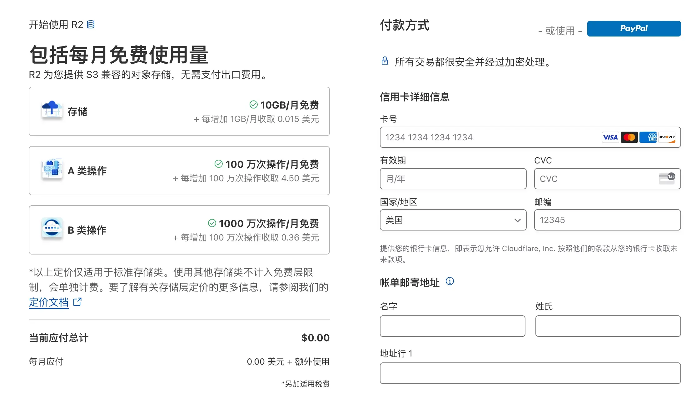
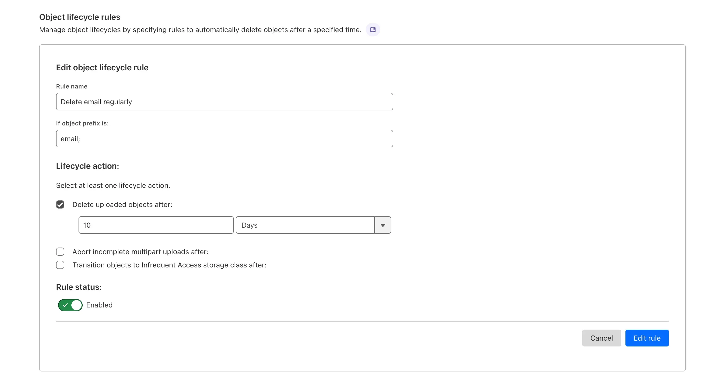
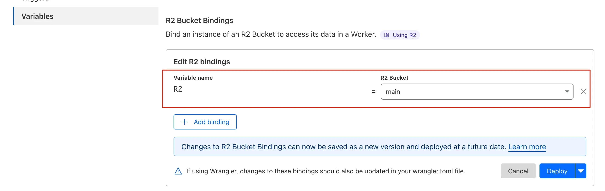
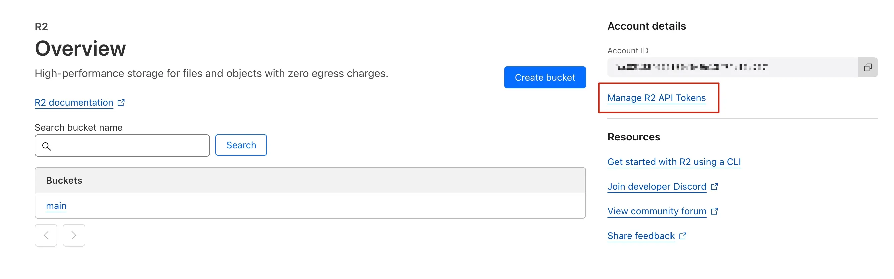
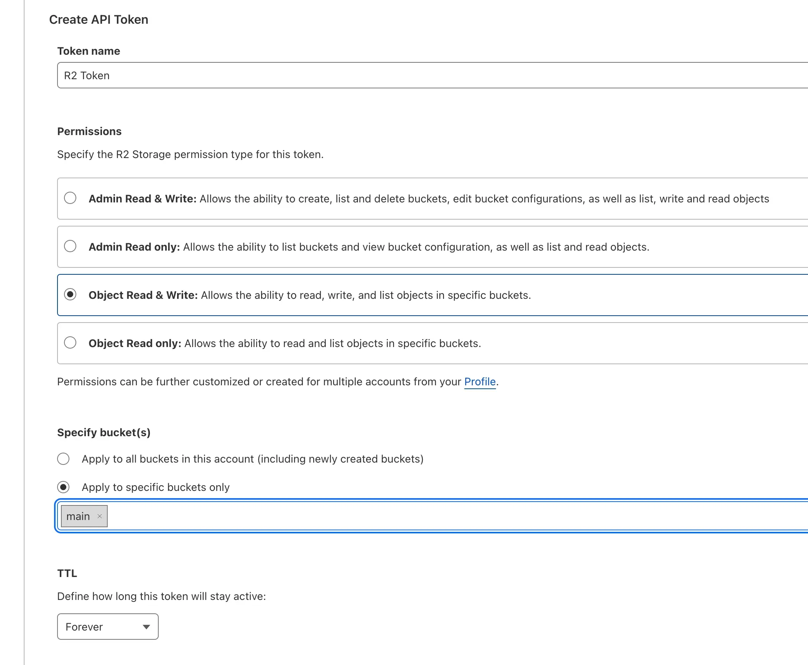

# 🧰 自建部署教程 (v1.0.4+)

## 邮件接收原理

使用 Cloudflare 的邮件转发功能，将接收到的所有邮件通过 Workers 上传到 R2 存储中，然后本程序会从 R2 存储中获取邮件。

**所以自建的邮箱域名必须使用 Cloudflare 进行 DNS 解析**

## 开启邮件转发 & 创建 Workers

- 首先开启邮件转发，按照官方流程来就行

- 创建一个 Workers，模板随便选都可以


创建好之后点击`Code editor`编辑代码，将[此处](doc/workers.js)的代码粘贴进去，然后别忘记点击`Save and deploy`部署:


- 然后需要添加一条`Catch-All`的规则，注意要选择`Send to a Worker`，如图:


## 创建 R2 存储

- 需要添加信用卡信息才能使用，以下是可用的免费额度



- 创建一个存储桶名称叫`main`，其他名称也可以在环境变量中指定即可

- 创建完成之后添加一个自动删除的规则 `Settings -> Object lifecycle rules`



## 关联 R2 和 Workers

- 打开`Email Workers`，然后点击`Manage Worker`


- 点击选项`Settings -> Variables -> R2 Bucket Bindings`，如图添加一条绑定关系:



## 创建 R2 API Token

- 切换到 R2 选项，点击`Manage R2 API Tokens`



- 如图创建一条`API Token`纪录，记下生成的 Token 信息后面要用



## 环境变量配置

- `CF_ACCOUNT_ID`: Cloudflare 的 AccountID（必须）
- `R2_ACCESS_KEY_ID`: R2 存储 APIToken 的 AccessKeyId（必须）
- `R2_SECRET_ACCESS_KEY`: R2 存储 APIToken 的 SecretAccessKey（必须）
- `DOMAIN_LIST`: 支持的域名列表，使用`|`分割，例如: `@isco.eu.org|@isco2.eu.org`，不要忘记`@`符号（必须）

- `R2_BUCKET`: R2 存储桶的名称，默认`main`（非必须）
- `MICROSOFT_CLARITY`: 微软 Clarity 统计，默认关闭（非必须）
- `ADMIN_ADDRESS`: 管理员地址，使用此地址可以查看所有的邮件列表（非必须）
- `HOSTNAME`: 服务监听地址，默认为`127.0.0.1`（非必须）
- `PORT`: 服务监听端口，默认为`3000`（非必须）

## 部署

_请修改其中的环境变量配置_

### Docker

```shell
docker run --name mail -d --restart unless-stopped -e 'HOSTNAME=0.0.0.0' -e 'CF_ACCOUNT_ID=xxx' -e 'R2_ACCESS_KEY_ID=xxx' -e 'R2_SECRET_ACCESS_KEY=xxx' -e 'DOMAIN_LIST=@isco.eu.org|@isco2.eu.org' -p 3000:3000 sunls24/temporary-mail
```

### Docker Compose & Caddy (推荐)

_如果不需要反向代理，需要设置`HOSTNAME=0.0.0.0`环境变量_

**docker-compose.yaml**

```yaml
version: "3.0"

services:
  mail:
    container_name: mail
    image: sunls24/temporary-mail:latest
    network_mode: host
    restart: unless-stopped
    environment:
      - "CF_ACCOUNT_ID=xx"
      - "R2_ACCESS_KEY_ID=xxx"
      - "R2_SECRET_ACCESS_KEY=xxx"
      - "DOMAIN_LIST=@isco.eu.org|@isco2.eu.org"
```

**Caddyfile**

```text
mail.example.com {
    reverse_proxy 127.0.0.1:3000
}
```
